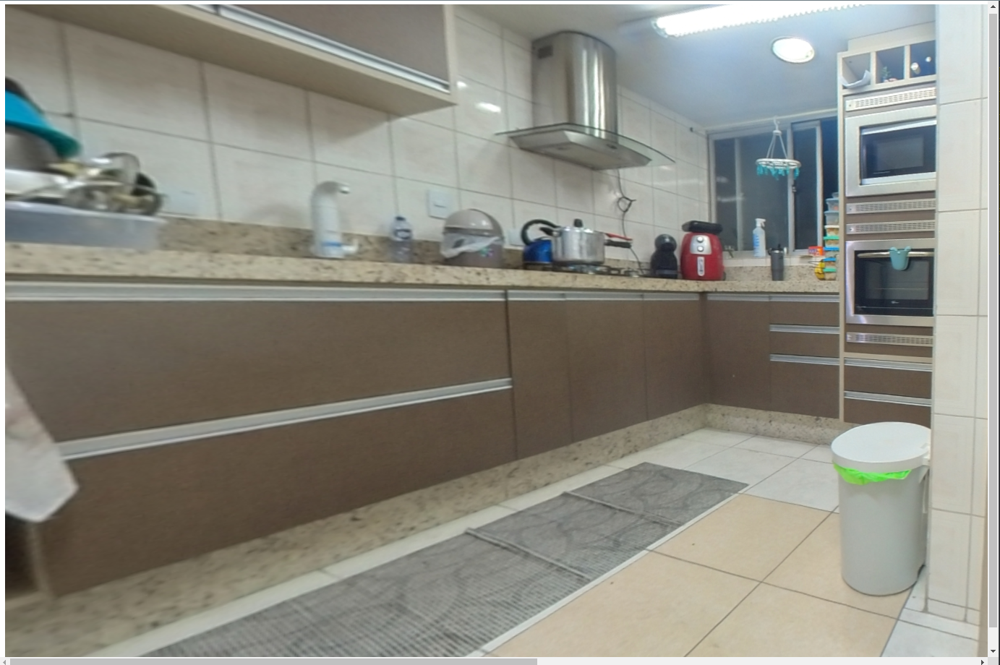

  Exemplo do uso de threeJS junto com Angular

  

## ✨ Tecnologias

- [Angular](https://angular.io/)
- [ThreeJS](https://threejs.org/)
- [TypeScript](https://www.typescriptlang.org/)

## 📝 License

Esse projeto está sob a licença MIT. Veja o arquivo [LICENSE](LICENSE) para mais detalhes.

---

## Development server

Run `ng serve` for a dev server. Navigate to `http://localhost:4200/`. The app will automatically reload if you change any of the source files.

## Terminal Commands

1. Install NodeJs from [NodeJs Official Page](https://nodejs.org/en).
2. Open Terminal
3. Go to your file project
4. Run in terminal: `npm install -g @angular/cli`
5. Then: `npm install`
6. And: `ng serve`
7. Navigate to: [http://localhost:4200/](http://localhost:4200/)
